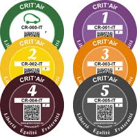

#### Sélectionner les véhicules

Pour inciter les gens à ne pas prendre leur voiture dans leurs déplacements urbains, **certains proposent d’implémenter un péage urbain**. Pour Nicolas Dupont-Aignant (Debout la France), people{maire de banlieue}{maires-banlieue}, il faut au contraire **supprimer les péages au voisinage de Paris** pour limiter les reports sur les routes empruntées quotidiennement par les travailleurs {parisien-banlieue-colere}.

Pour people{Anne Hidalgo}{anne-hidalgo}, ce type de stratégie est intéressant car il permet de financer les transports en commun, ce qui permet de **ne pas faire des péages urbains une source de fracture sociale**. {orange-peage-urbain}

Un compromis possible pour réduire le nombre de véhicules en ville est de **sélectionner parmi les plus polluants**. Ainsi, la mairie de Paris a mis en place l’utilisation de **la vignette Crit’Air**, qui se base sur la pollution émise par les véhicules pour les interdire à la circulation en cas de pic de pollution. Pour people{Pierre Chasseray}{pierre-chasseray} {courrier-picard-contre-pollution}, **un tel dispositif est cependant inutile** puisque dans quelques années **les normes utilisées ne seront plus en phase avec les niveaux de pollution atteints par les véhicules**, qui sont en constante diminution. En remplacement, la Région propose plutôt **une taxe sur les poids lourds**, qui sont les véhicules les plus polluants {monde-fermeture-qualite-air}.

Ce dispositif est également attaqué de façon très virulente par la Fédération Française des Automobilistes Citoyens (FFAC) qui **invite à la désobéissance civile**, en ne respectant pas les interdictions liées à Crit'Air. Pour elle, la vignette est intrinsèquement inégale :
quote{Se déplacer dans un véhicule particulier deviendra le privilège d’une minorité aisée de citoyens sélectionnée selon leurs moyens ou selon des critères sans aucun lien avec la lutte anti-pollution}{Extrait de la [pétition de la FFAC](https://www.change.org/p/non-aux-vignettes-crit-air-et-aux-zcr-oui-a-de-reelles-solutions-pour-lutter-contre-la-pollution )}

Comme nous le voyons dans la citation, **ce système discrimine les classes défavorisées**, qui n'ont pas les moyens de changer régulièrement de véhicule. Or, les véhicules les plus polluants sont souvent les plus anciens, donc interdire aux véhicules polluants de ciculer revient à [écarter toute une frange de la population](#inegalites-socioprofessionnelle).

Cela va dans le sens de people{Florence Berthout}{florence-berthout}, maire LR du 5ème arrondissement, qui trouve plus judicieux **d’instaurer une taxe sur l’utilisation des gros diesels polluants**, achetés davantage par les foyers aisés. {atlantico-interdire-paris-pauvres}
