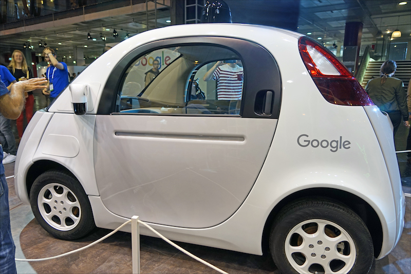

#### Les véhicules autonomes bientôt sur les routes ?
 
Pour d’autres acteurs, le futur de la voiture, c’est le véhicule autonome. Plusieurs start-up françaises se sont lancées dans la conception de tels véhicules avec pour ambition de les voir **circuler d’ici quelques années**.

C’est ainsi que Navya a signé un contrat avec EDF pour faire circuler six navettes autonomes afin de transporter des employés sur le site de la centrale de Civaux. **Plusieurs tests sont en cours**, même si la règlementation française exige pour l’instant la présence d’un opérateur à bord pour veiller au bon fonctionnement du véhicule. La RATP a aussi conduit une expérimentation sur le pont Charles de Gaulle entre la Gare de Lyon et celle d’Austerlitz en début d’année, avec plus de 30 000 voyageurs qui ont pu monter à leur bord. {atelier-bnp-vehicule-demain}

Le véhicule autonome représente cependant **un véritable défi technologique**. Il doit savoir interagir avec les autres usagers de la route et évoluer dans des espaces complexes tels que le périphérique parisien où il doit gérer les changements de files, les voitures qui se rabattent, les enchaînements de phases d’accélération et de freinage…

Monsieur Sapet, président de Navya assure que **le véhicule autonome saura répondre à ces défis technologiques** grâce à ses multiples capteurs assurant la collecte *« de données importantes pour assurer la sécurité de fonctionnement de nos véhicules »*. Un réseau 5G est également nécessaire pour **assurer la communication des véhicules** entre eux mais aussi avec les infrastructures et les autres usagers de la route.

L’accident mortel impliquant une voiture sans chauffeur et la société Uber qui a coûté la vie à une piétonne le 18 mars dernier suscite encore des débats sur la sécurité de tels engins. Un autre problème soulevé est **d’ordre éthique**. Que devrait faire une voiture autonome face à un dilemme moral, sauver la vie de son passager ou le sacrifier pour en sauver d’autres ? Si la logique suivie peut être de sauver le plus grand nombre de vie, **aucun consommateur n’est prêt à acheter un véhicule qui pourrait volontairement le sacrifier**. {point-navya} {france-bleu-autonome-periph} {figaro-francais-murs}

Malgré les défis auxquels doit encore répondre la voiture autonome, cela n’empêche pas certains élus d'y croire. Ainsi, à l’occasion du CNI rassemblant ministres et industriels dans le but d’améliorer la compétitivité industrielle, se tenant dans un centre de Valéo fin 2017, les membres du gouvernement ont pu emprunter des navettes autonomes. Très satisfait par cette expérience, le premier ministre Édouard Philippe a pu dévoiler son plan qui place comme mission numéro un les véhicules autonomes : _« S’agissant du véhicule autonome, les progrès sont rapides sur le plan technologique… cela requiert une transformation profonde du cadre réglementaire, un aménagement des villes et des territoires, une offre industrielle performante, une adaptation de compétences qu’il convient aujourd’hui d’accélérer. »_ Cette déclaration a été approuvée et soutenue par la ministre des transports, Elisabeth Borne, et le ministre de l’économie et des finances, Bruno Le Maire.

Valérie Pécresse, prévoit justement un investissement de 100 millions d’euros afin de **réaménager plusieurs grands axes de la Région** pour permettre **la circulation de véhicules autonomes**. L’objectif est d’utiliser les bandes d’arrêt d’urgence capables de dialoguer avec des voitures de plus en plus intelligentes. La présidente de la Région veut inciter les usagers à abandonner leur véhicule pour emprunter des navettes qui circuleraient sur cette voie privilégiée et ainsi réduire le trafic. Concernant la législation, le président de la République a annoncé fin mars dernier que ces véhicules seraient autorisés dans la circulation dès 2022. {navy-vehicules-autonomes} {bfm-voiture-autonome-bouchons} {bfm-idf-voiture-autonome}

Cependant, le sociologue Bruno Marzloff, spécialiste de la mobilité et de la révolution des *smart cities* rappelle tout de même qu’**une voiture reste une voiture**. Quand bien même ces nouveaux modèles seraient moins polluants, ils demeurent **envahissants et générateurs d'effets pervers**. Enfin, Olivier Blond nous a rappelé que **les voitures électriques émettent aussi des particules** qui proviennent de l’usure des pneus et des freins. Elles sont cependant moins toxiques que celles provenant de la combustion. {usine-nouvelle-delivrer-ville}
