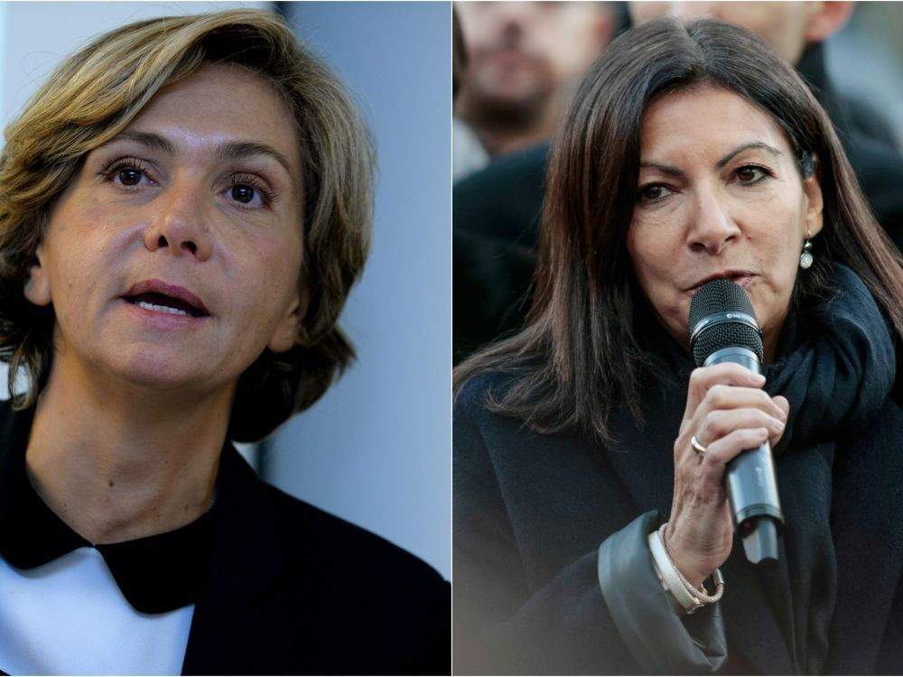

### Répartition des compétences territoriales ?

Différents acteurs peuvent **prendre des mesures pour agir sur la mobilité dans Paris**. Ces acteurs ont des champs d’action différents, que ce soit en termes de **domaines de compétences** ou de **découpage des territoires** sur lesquels leurs pouvoirs s’étendent. Cependant, les délimitations même de ces domaines de compétences **sont débattues et contestées**. En outre, planifier des mesures pour la ville demande **une grande coopération**. La contraposée étant que des divergences entre les acteurs peut être **source de difficultés dans la prise de décision et la mise en place d’actions sur le long terme**.

#### Motivations politiques d'Anne Hidalgo ?

Pour les prises de décision à l’échelle de la Ville, le **Conseil de Paris** est une assemblée d’élus où sont votées des mesures. Pour people{Anne Hidalgo}{anne-hidalgo}, les prises de décisions sont compliquées par le fait que son parti (le PS) ne possède pas la majorité au Conseil. En revanche, **le soutien des élus d’Europe Écologie Les Verts lui assurerait la majorité**. Selon les propos de people{Pierre Chasseray}{pierre-chasseray}, cela expliquerait le fait qu’elle s’accroche au projet de fermeture des voies sur berges, ou plus généralement **aux entreprises luttant pour réduire la place de la voiture**. Cela constitue pour elle une garantie de soutien des Verts et donc **un atout politique**. {afp-hidalgo-pietoniser} {entretien-chasseray}

#### Plus de pouvoir pour la région ? Pour la ville ?

Il faut cependant garder en tête qu’**un changement de voirie au centre de Paris aura [des répercussions dans des périmètres bien plus étendus](#economie-locale)**. C’est pourquoi la Région peut chercher à obtenir du pouvoir décisionnel sur certaines mesures prises intra-muros.

Par exemple, pour la fermeture des voies sur berges (rive droite), la **région Île-de-France** a classé ces voies comme voies routières d’intérêt régional pour **obtenir la légitimité d’intervenir**. {afp-pietonisation-votee} {afp-rendre-berges}

De façon inverse, la ville souhaiterait avoir plus de pouvoir afin de faciliter les prises de décisions. people{Anne Hidalgo}{anne-hidalgo} affirme en mars 2018 que people{Valérie Pécresse}{valerie-pecresse}, à qui elle attribue la charge des transports publics en tant que dirigeante de la Région, **retarde la création d’un bus sur les quais hauts en site propre** (annoncée en 2021 au lieu de 2019 comme initialement prévu). Elle aimerait ainsi que la mairie de Paris et la métropole aient **davantage de pouvoir décisionnel** dans la gestion des transports en commun par rapport au **conseil régional**. {challenge-vsb-arrete-pietonnisation}

#### La collaboration à différentes échelles : Paris, la métropole, la région, l’état.

Toutefois, quels que soient les intérêts des acteurs, tous s’accordent à dire qu’**il est nécessaire qu’une coordination existe entre les représentants de territoires à champs d’actions plus ou moins étendus spatialement**. Par exemple, pour des mesures telles que la suppression des voitures diesel dans Paris, il peut être intéressant de réfléchir à l'échelle nationale en proposant une prime à la casse. C’est ce qu'Anne Hidalgo invitait l’État à faire, dès 2013 (soit avant son élection au poste de maire de Paris). De même, les conceptions de plans pour les politiques de mobilités sont faites en réflexions conjointes de la ville, la Région et la métropole.

Dans ce contexte, l’opposition actuelle entre people{Anne Hidalgo}{anne-hidalgo} et people{Valérie Pécresse}{valerie-pecresse} peut être un frein aux planifications concernant la mobilité. _« L'épineuse question des transports en Île-de-France ne pourra être résolue sans que ces deux actrices travaillent ensemble… »_. Le manque de concertation pendant la mise en place de la fermeture des voies sur berges a été [un des points les plus critiqués](#qui-est-consulte) {moniteur-hidalgo-tient-bon}

En 2016, au moment où le projet est lancé, **les réactions accusant le manque de coopération sont nombreuses** : plusieurs people{maires de banlieue}{maires-banlieue} (Hervé Marseille, Jacques J.P. Martin, Christian Cambon) soutiennent que la mairie de Paris prend des décisions unilatérales et réclament **une meilleure concertation entre la capitale et la banlieue**.

En outre, Les Républicains **déplorent l’absence d’étude sur le tracé alternatif** qu’ils ont proposé en amont du projet. Ainsi, Les Républicains 75 ainsi que le **conseil régional** (Vincent Roger) accusent Anne Hidalgo de ne pas permettre le dialogue, voire de **refuser le débat**. Cette opinion est également partagée par des élus de la ville comme Éric Azière, président du groupe UDI-Modem au Conseil de Paris, bien qu’il réagisse avec moins d’animosité, **invitant à la collaboration dans le cadre d’un nouveau plan de circulation**. {gazette-reussir-penser} {figaro-vsb-paris} {afp-pietonisation-votee} {afp-pietonisation-lr-justice} {afp-hidalgo-pietoniser}

Pour pallier ce manque de coopération, plusieurs solutions sont proposées par les élus de la Région et de Paris. Jacques J.P Martin, maire de Nogent-sur-Marne, demande à la mairie **la création d’un comité de pilotage mixte Paris-banlieue afin d’étudier des solutions de transports alternatives**. L’Udi-Modem souhaiterait **la tenue d’États Généraux de la circulation**. {afp-pietonisation-votee} {monde-polemique-berges}

Au-delà du manque de concertation entre les acteurs agissant pour la mobilité, c’est également **un manque de prise en compte de l’avis des habitants** qui est déploré dans le cadre du projet de fermeture des voies sur berges. L’association 40 Millions d’automobilistes (via son délégué général people{Pierre Chasseray}{pierre-chasseray}) accuse ainsi people{Anne Hidalgo}{anne-hidalgo} **d’imposer la fermeture des voies sur berges durant la fin des vacances** afin de rencontrer une opposition plus faible de la part des Parisiens. {20-min-empecher-retour-voitures}

Plus généralement, les personnes attaquants la décision de piétonisation de la rive droite en Novembre 2016 indiquent que la principale motivation de leur action est le passage en force de la Ville de Paris sur ce projet. {figaro-forcing-hidalgo}

#### La préfecture de Police : un soutien nécessaire à l’aboutissement de tout projet

Le préfet de police doit valider toute mesure de modification de la voirie, et son soutien est souvent utilisé comme argument d'autorité par les élus. Par exemple, pour le projet des voies sur berges, celui-ci a appuyé people{Anne Hidalgo}{anne-hidalgo} en permettant une période d’essai en septembre 2016, et c'est ce qui a donné le feu vert officiel à la piétonnisation de la rive droite. Ses décisions sont principalement basées sur des critères de sécurité. Ainsi, il cherche notamment à assurer que les véhicules de secours puissent circuler, même dans un contexte de fermeture de voies.

Le préfet de police Michel Gaudin affirmait, au lancement du projet : *"les conditions de recours à la clause de réversibilité des aménagements devront être précisées, de même qu'un travail complémentaire sur les questions de pollution et de temps de trajet des secours."* {figaro-mag-vsb-remous}

Ces collaborations sont d’ailleurs un fait qui est mis en avant par la maire elle-même, quand elle affirme avoir pris un arrêté de piétonisation des voies sur berges en quote{concertation avec l'Etat et le préfet de police, pour pouvoir maintenir les berges piétonnes.}{people{Anne Hidalgo}{anne-hidalgo}} Ainsi, c’est même un argument qu’elle utilise pour critiquer les propositions d’alternatives portées par la région à propos de ce même projet. {challenge-vsb-arrete-pietonnisation}

#### La commission d’enquête publique : fournisseur de rapport consultatifs centraux dans les débats publics

La **commission d’enquête publique** de la ville de Paris est une commission formée au sein de l’assemblée nationale et du Sénat. Son rôle est purement consultatif : l’objectif est pour elle est d’estimer les conséquences de décisions, en se basant sur les mesures officielles existantes, prises notamment par **Airparif** ([voir : Qui réalise les mesures ?](#airparif)) . Vis-à-vis des avis qu’elle rend, les élus restent toutefois libres de passer outre ses recommandations, quitte à être les cibles de critiques.

Ainsi, dans le cas de la fermeture des voies sur berges, **people{Anne Hidalgo}{anne-hidalgo}** a décidé en Août 2016 de faire fi de la condamnation du projet par la commission d’enquête. Cela lui vaut des réactions indignées, notamment par Philippe Goujon, maire d’arrondissement, qui affirme qu’**people{Anne Hidalgo}{anne-hidalgo}** n’écoute que les avis qui vont dans le sens du projet. {afp-pietonisation-lr-justice} {afp-hidalgo-pietoniser} {moniteur-hidalgo-tient-bon}

Les rapports rendus par la commission restent une référence et constituent un argument central dans les débats publics. Par exemple, Florence Berthout, maire LR du 5ème Arrondissement, peut s’y appuyer pour souligner l’absence de concertation de la Ville de Paris avec les arrondissements et les communes concernées. Serge Federbusch, président du parti des Libertés, affirme qu’un avis défavorable de la part de la commission d’enquête est rare et prouve donc la faiblesse du projet de la Ville de Paris. {atlantico-interdire-paris-pauvres}

Ce poids de la commission dans les débats politiques explique la vive réaction des défenseurs du projet de piétonisation lorsque le rapport s’y est montré clairement opposé.

La mairie de Paris et **Christophe Nadjovski** accusent ainsi la commission d’enquête d’avoir une opinion biaisée sur le projet, et d’avoir minimisé les avantages au profit des inconvénients listés par les opposants. {20-minutes-50-ans-retard} people{Anne Hidalgo}{anne-hidalgo} affirme en effet que le rapport de la commission d’enquête ne tient pas compte des motifs environnementaux, sanitaires, urbains et culturels à l'origine de ce projet de piétonisation. {afp-hidalgo-pietoniser} {moniteur-hidalgo-tient-bon}

#### Le tribunal administratif : un arbitre légal contesté

Le tribunal administratif a un rôle juridique vis-à-vis de la répartition du pouvoir, notamment ici concernant la politique de mobilité territoriale. Ainsi, si il fait état d’un abus de position d’un acteur, il est en son pouvoir de revenir sur des décisions, ou interdire certaines mesures. Le tribunal administratif sanctionne également le cadre dans lequel la décision a été prise. Il souligne par exemple que l'utilisation de l'article L. 2213-2 du Code général des collectivités territoriales (CGCT) ne permet pas au maire d'interdire de façon permanente une voie aux automobilistes. {gazette-feuilleton-vsb}

De plus, après la décision par le tribunal d’annuler la fermeture des voies sur berges en 2018, il était à craindre que la tentative d’**Hidalgo** de changer d’objectifs pour prolonger le projet soit à nouveau rejeté par le tribunal. En effet, Yvon Goutal, avocat spécialiste des contentieux administratifs indique que le tribunal administratif pourrait considérer la modification des objectifs du projet par la Mairie de Paris dans le nouvel arrêté comme un obstacle à la décision de justice. {gazette-feuilleton-vsb}

Toutefois, La Mairie de Paris affirme que le nouvel arrêté de Mars 2018 n’a pas pour but de contourner la décision du tribunal administratif mais en tire les conséquences. {monde-nouvel-arrete}

Aussi, ces limites légales restent critiquées, au nom de la légitimité. **Christophe Najdovski** (Mairie de Paris) affirme que Paris devrait avoir le droit de prendre la décision d’une fermeture définitive d’un axe de circulation sinon elle serait incapable de mettre fin à une autoroute urbaine. {point-revers-hidalgo}
