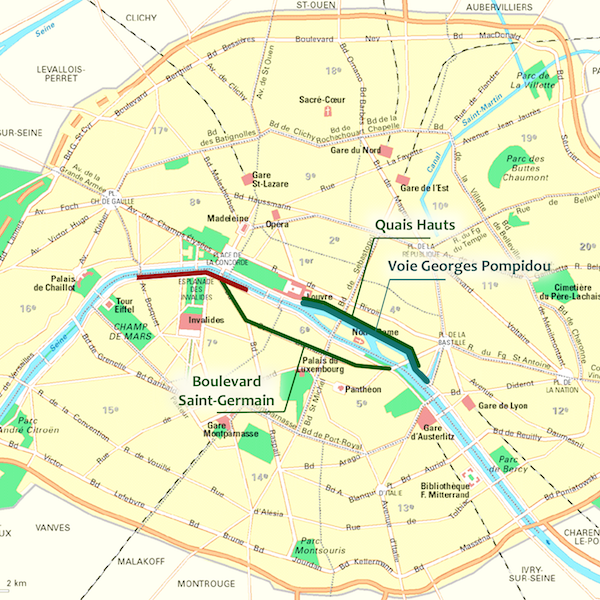

## Les prévisions de la mairie sont-elles réalistes ?

Le 8 Août 2016, people{la commission d’enquête}{commission-enquete-publique}, présidée par le juge administratif François Amblard et regroupant trois membres désignés par **le tribunal administratif de Paris**, publie un rapport dans lequel elle rend un avis défavorable sur le projet de piétonnisation des voies sur berge de la rive droite. La commission justifie sa position en critiquant l’étude d’impact proposée par **la mairie de Paris**.

Cet évènement déclenche de nombreuses réactions de la part de l’exécutif parisien (y compris la people{maire de Paris}{anne-hidalgo}), du conseil régional (présidé par people{Valérie Pécresse}{valerie-pecresse}), mais également des people{maires d’arrondissements et de banlieue}{maires-banlieue} ainsi que des associations telles que **40 millions d’automobilistes** (par l'intermédiaire de son délégué général people{Pierre Chasseray}{pierre-chasseray}).

Les discussions sont centrées sur le modèle et les hypothèses retenues par la mairie de Paris pour évaluer les conséquences de la piétonnisation des voies sur berge de la rive droite et donc de la fermeture à la circulation automobile de la voie Georges Pompidou, sur le trafic routier et sur la pollution.

### Quelles zones concernées ?

Le choix du périmètre de l’étude d’impact par la mairie de Paris, regroupant les 1er, 4e, 7e et 12e arrondissements, est contesté par people{la commission d’enquête}{commission-enquete-publique}, qui prévoit des reports de circulation de près des trois quarts des véhicules qui ne pourront plus emprunter les voies sur berge dans les 5e, 6e et 8e arrondissements. {afp-hidalgo-pietoniser}.

De plus, la commission d’enquête invite la mairie de Paris à inclure dans l’étude toutes les zones potentiellement affectées, y compris les banlieues {monde-polemique-berges} où people{les maires}{maires-banlieue} s’inquiètent des conséquences de cette fermeture : _« L’A4 est déjà le plus gros bouchon d’Europe, la fermeture des voies sur berge ne fera qu’aggraver la situation, en détournant une partie des voitures sur cette grande boucle ! »_ s’indigne **Jacques-Alain Bénisti**, maire LR de Villiers-sur-Marne (Val-de-Marne) {parisien-banlieue-colere}.

**Chantal Jouanno**, vice-présidente du conseil régional d’Île-de-France et chargée de l’écologie et du développement durable va dans le même sens que la commission : _« La région est prête à faire avec Paris les études demandées en prenant en compte l'impact non seulement sur le centre de la capitale, mais aussi sur les arrondissements périphériques et la banlieue. »_ {monde-polemique-berges}.

people{Christophe Najdovski}{christophe-najdovski} (Europe Écologie Les Verts), adjoint d’people{Anne Hidalgo}{anne-hidalgo} en charge des transports rétorque en affirmant que des études d’impact sur un périmètre plus large ont déjà été réalisées : _« Nous avions alors regardé les reports de circulation dans Paris, sur le périphérique et en dehors de Paris. Nous avions alors mis en évidence que les reports de circulation se faisaient essentiellement dans Paris intra-muros, ils étaient marginaux sur le périphérique et quasiment inexistant en dehors de Paris. »_ {20-minutes-50-ans-retard}. Il poursuit en précisant que _« les études montrent que la piétonisation des berges rive droite entraîneront des reports de circulation sur les quais hauts et le boulevard Saint-Germain. »_ tandis que **la maire de Paris** complète en affirmant que ce report de circulation est _« tout à fait absorbable »_ sur ces deux axes. {afp-hidalgo-pietoniser}

### Une évaporation de la circulation ?

_« Ce projet entraînera une évaporation de la circulation. Des études montrent que certains délaisseront la voiture pour d'autres modes de déplacement. Ce n'est pas pris en compte.»_ {figaro-forcing-hidalgo} affirme people{Christophe Najdovski}{christophe-najdovski}. L’adjoint d’people{Anne Hidalgo}{anne-hidalgo} souligne en effet que la circulation sur la rive droite a diminué de 25 % depuis que la voie express a été transformée en boulevard urbain entrecoupé par des feux de circulations. {afp-rendre-berges}.

**Anne Hidalgo** s'appuie quant à elle sur la diminution d'environ 23 % du trafic automobile entre 2011 et 2014 après la piétonisation des voies sur berge de la rive gauche par son prédécesseur, Bertrand Delanoë, pour justifier l’existence de ce phénomène _« d’évaporation de la circulation »_. {jdd-projet-hidalgo}.

Un spécialiste des mobilités, people{Frédéric Héran}{frederic-heran}, affirme dans un entretien avec le journal *L'Express* que ce phénomène _« d’évaporation de la circulation »_ est vérifié à chaque mise en place de projet contraignant pour la circulation : _« À chaque fois que l'on réduit la capacité de la voirie, on observe qu'une petite partie du trafic disparaît: environ 10% à court terme et un peu plus - environ 20% - à long terme. »_ {express-trafic-diminue}

Cette _« évaporation de la circulation »_, couplée aux mesures de réduction de la place de la voiture annoncées par la Ville de Paris, justifient selon **Anne Hidalgo** l’absence d’une partie du trafic actuel sur les berges dans les modélisations : _« Oui il y aura moins de voitures à Paris, clairement. Donc je ne me projette pas, y compris dans la façon dont on peut calculer les effets de report de circulation, dans un monde où il y aurait autant de voitures qu'aujourd'hui. Objectivement ça ne sera plus le cas. »_ {afp-rendre-berges}. _« Rien ne lui permet d'affirmer que cette “évaporation” aura lieu. »_ rétorque cependant people{Serge Federbusch}{serge-federbusch}, ancien conseiller à la mairie de Paris pour l'urbanisme et les transports. Une vision partagée par people{Pierre Chasseray}{pierre-chasseray}, délégué général de **40 millions d’automobilistes**, qui la décrit comme une prospective arbitraire : _« on peut tout aussi bien faire la prospective inverse. »_ {entretien-chasseray}

### Des mesures précises ou imprécises ?

quote{« L'analyse des déplacements n'est pas une science exacte. »}{Frédéric Héran, enseignant à l’université Lille 1, spécialiste des questions de mobilité {express-trafic-diminue}}

Contrairement à **la mairie de Paris** qui soutient que les études de circulation présentées sont _« objectives et extrêmement précises »_ {afp-hidalgo-pietoniser}, people{la commission d’enquête}{commission-enquete-publique} indique que la piétonnisation des voies sur berges va engendrer des reports de circulation et des embouteillages plus importants que ceux annoncés dans les simulations. {figaro-vsb-paris}

En novembre 2016, une quinzaine de personnes (riverains, commerçants et militants associatifs) attaquent la décision de la mairie de Paris. Leur avocat, **Maître Jean-Baptiste Iosca** dénonce notamment les imprécisions de l’étude d’impact concernant la circulation. {figaro-vsb-justice} people{Frédéric Héran}{frederic-heran} justifie la présence de ces imprécisions dans les études de la circulation par les difficultés rencontrées pour mesurer et modéliser les changements d’habitudes des utilisateurs et leurs impacts sur la circulation. {express-trafic-diminue} Toutefois, people{Christophe Najdovski}{christophe-najdovski} se veut rassurant en indiquant que _« les études théoriques sont toujours plus pessimistes que la réalité. »_ {20-minutes-50-ans-retard}

Cela ne suffit pas à convaincre **la commission d’enquête** qui déclare manquer d’éléments, en particulier sur la provenance et la destination des véhicules utilisant les voies sur berges, pour conclure quant à l’intérêt public du projet, notamment du point de vue de la pollution de l’air {monde-polemique-berges}. people{Serge Federbusch}{serge-federbusch}, illustre cette remarque en estimant que les trois quarts des véhicules utilisant actuellement les voies sur berge de la rive droite ont disparu du bilan de pollution {figaro-pietonisation-quais}.

### Un air plus propre ?
« Rien ne montre que ce projet va améliorer la qualité de l'air, bien au contraire, il va l'aggraver avec les reports de circulation »_ s’exclame **Jean-François Legaret**, maire LR du 1er arrondissement. {monde-polemique-berges}.

people{La commission d’enquête}{commission-enquete-publique} est elle aussi dubitative sur l’amélioration de la qualité de l’air présentée dans l’étude d’impact {atlantico-interdire-paris-pauvres} : elle critique par exemple l’hypothèse retenue pour la vitesse au niveau des quais hauts de 50 km/h alors que les résultats des simulations sont d’environ 16 km/h en soulignant que _« les émissions polluantes des automobiles à la vitesse de 20 km/h sont deux fois supérieures à celles émises à la vitesse de 50 km/h »_. {figaro-pietonisation-quais}.

**Franck Laval**, président de l’association Écologie Sans Frontière, reconnaît qu’à court terme les embouteillages induits vont augmenter la pollution mais prévoit une amélioration sur le long terme grâce aux changements d’habitudes des utilisateurs. {monde-polemique-berges} Les prévisions people{d’Airparif}{airparif}, tablant sur une diminution de 23 % de la concentration de polluants (NO2, PM, benzène…), vont dans le même sens. {monde-polemique-berges}
