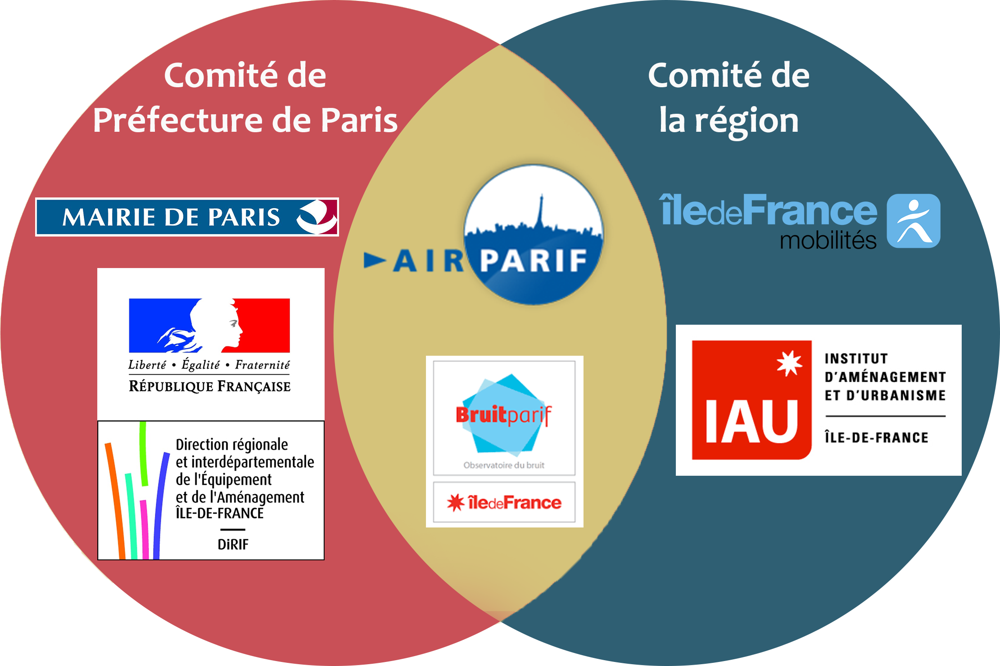

## Comment mesurer les conséquences ?

### Le comité de la préfecture de police

Un mois après la publication du rapport de la commission d’enquête, le préfet de police people{Michel Cadot}{michel-cadot} demande la tenue d’une période de suivi d’au moins six mois au cours de laquelle seront observées les conséquences de la piétonnisation sur la circulation, la pollution atmosphérique et les nuisances sonores. Ce comité est mis en place le 3 octobre 2016 et est composé des acteurs institutionnels tels que les **conseils régional et départemental**, la **mairie de Paris**, la **métropole du Grand Paris** ou encore **la chambre de commerce et d’industrie**. Sa fonction est de regrouper l’ensemble des données disponibles et relatives au trafic automobile et à la pollution et d’en proposer une analyse afin d’évaluer l’impact de la piétonnisation des voies sur berge. {rapport-vsb-prefecture}

_« [Les acteurs se sont accordés] sur une méthodologie et des outils de mesure qui pourront être suivis au fil des mois jusqu'au terme des six mois d'observation»_

**Michel Cadot, préfet de police** {monde-fermeture-qualite-air}

Les données sont recueillies et analysées par différents organismes. **La pollution de l’air et les nuisances sonores** sont traitées respectivement par people{Airparif}{airparif} et people{Bruitparif}{bruitparif}. **Le trafic routier régional** est étudié par la Direction Régionale et Interdépartementale de l’Equipement et de l’Aménagement d’Île-de-France (DRIEA), composé notamment de people{la Direction interdépartementale des routes d’Île-de-France (DiRIF)}{dirif}. **Les informations sur le trafic routier parisien** sont relevées par la Direction de la Voirie et des Déplacements de la mairie de Paris puis sont exploitées par la société SYSTRA. Enfin, **les circulations des véhicules de secours et de police et les transports publics** sont respectivement observées par les services opérationnels de la **préfecture de police** et la **RATP**. {rapport-vsb-prefecture}

### La réponse de la Région : un autre comité !

Quelques jours après la demande de mise en place d’un comité de suivi par la **préfecture de police de Paris**, la présidente de la Région Île-de-France people{Valérie Pécresse}{valerie-pecresse} annonce la création d’un **comité de suivi régional** {afp-pietonisation-votee}. Installé le 12 septembre 2016, cet observatoire est présidé par **Pierre Carli**, médecin chef du Samu de Paris, et regroupe plusieurs institutions dont certaines sont également membres du comité de suivi de la préfecture comme people{Airparif}{airparif} et people{Bruitparif}{bruitparif} en charge des aspects de pollution de l’air et des nuisances sonores. Ainsi, tandis que la **RATP** et **Île-de-France mobilités** (ex STIF) observent les impacts sur les transports publics, c’est l’Institut d’Aménagement et d’Urbanisme d’Île-de-France qui exploite les données fournies par la DRIEA, le conseil départemental des Hauts-de-Seine (débits et comptages) et la société Autoroutes Trafic (temps de parcours). L’ONG France Nature Environnement Île-de-France et l’Observatoire Régional de Santé Île-de-France complètent ce comité. {rapport-comite-regional}

### Des résultats (déjà) contestés

Dès l’annonce de la création du comité de suivi par le préfet de police, le groupe Les Républicains (ex UMP) du **Conseil de Paris**, présidé par **Nathalie Kosciusko-Morizet**, qui réclamait l’installation des capteurs avant la fermeture des voies sur berges conteste la pertinence des futurs résultats du comité de suivi de la préfecture. {afp-pietonisation-votee}.

L’absence d’état initial lié à l’absence de capteurs avant la fermeture dans les zones concernées est également regretté par people{Olivier Blond}{olivier-blond}, président de l’association Respire et membre du conseil d’administration d’people{Airparif}{airparif}. Il souligne ainsi que les observations des comités vont permettre la réalisation d’une étude de suivi et non d’une étude d’effet, ce qui complique l’analyse des données et ouvre la possibilité à des interprétations très différentes alors que les données fournies par Airparif sont communes. {entretien-blond}

Malgré une harmonisation des méthodologies des comités demandée par le préfet de police, [des différences subsistent](#comment-prevoir-les-consequences). **Le comité régional** dénonce notamment l’absence d’objectivité dans les méthodes utilisées pour mesurer l’impact de la piétonnisation de la rive droite. Il critique également l’étude d’impact de la mairie de Paris dont il juge l’étude acoustique _« incohérente »_ et _« imprécise »_ et déplore l’absence de réponse de la Ville de Paris à leurs sollicitations pour obtenir les méthodes utilisées dans cette étude. {echos-region-contredit}.
