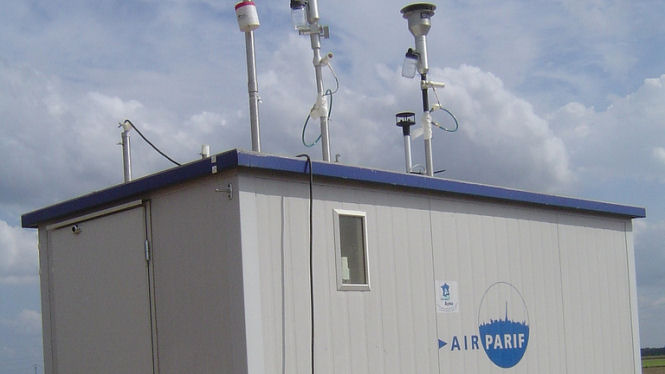

## La qualité de l'air s'est-elle améliorée ?

\start_encadre

### Qui sont les victimes de la pollution ?

quote{_« La pollution de l'air est responsable, chaque année, de 48 000 décès prématurés en France — dont 6500 à Paris (…) Dans la capitale, le trafic routier est la cause principale de cette pollution.»_}{Anne Hidalgo, Maire de Paris {figaro-forcing-hidalgo}}

Dans _Notre-Drame de Paris_ (Albin Michel), Airy Routier et Nadia Le Brun cherchent la source de ces estimations _« supérieures à celle de 42 000 morts par an de l’étude CAFE (Clean Air For Europe) qui date de 2005. »_ Il s’agit d’une étude publiée par Santé publique France, organisme créé en 2016 _« et qui, dès sa première année d'existence, a reçu un prix de… communication. »_ De plus, les auteurs précisent qu’il s’agit de morts prématurées et s’interrogent sur les méthodes scientifiques utilisées pour déterminer l’influence de la pollution dans le décès des personnes. {figaro-livre-accuse-hidalgo}

\stop_encadre

Les mesures et les analyses concernant la qualité de l’air des deux comités de suivi ont été effectuées par le même organisme, à savoir people{Airparif}{airparif}. L’agence a réalisé deux campagnes de mesure d’une durée d'un mois chacune, la première ayant eu lieu du 15 novembre 2016 au 13 décembre 2016 et la seconde du 30 mai 2017 au 27 juin 2017. Elle a ainsi pu prendre en compte l’influence des conditions météorologiques ainsi que l’évolution des comportements et des habitudes des usagers.

Afin de couvrir un périmètre regroupant à la fois les voies fermées à la circulation et les itinéraires concernés par les reports de circulation à Paris et en proche banlieue, 80 points supplémentaires de mesure ont été installés et se sont ajoutés aux 60 stations initialement présentes, dont un point tous les 300 mètres le long des voies sur berge. {rapport-comite-regional}

Le rapport publié par Airparif*au deuxième semestre de 2017 et intégré aux deux rapports du **comité régional** et de la **préfecture** présentent **les variations des concentrations de dioxyde d’azote en fonction de la zone géographique**. Il a ainsi été observé une amélioration de la qualité de l’air au niveau des berges piétonnisées où les taux de polluants ont diminué de jusqu’à 25 % sur les quais bas. Des chiffres cités par people{Anne Hidalgo}{anne-hidalgo} pour montrer **l’amélioration de l’attractivité des voies sur berge pour les piétons et cyclistes** {monde-ptit-velib}.

Toutefois, **les teneurs en dioxyde d’azote ont augmenté jusqu’à 15 % sur le quai Henri IV et de Bercy** et, de manière plus limitée (1 % à 5 %), sur les axes de report tels que le boulevard Saint-Germain. De faibles écarts ont également été notés sur l’A4, l’A86 et l’A13. {rapport-comite-regional}.

**Pierre Carli**, président du comité de suivi régional, complète ces données en indiquant une augmentation de 53 % en oxyde d’azote et de 49 % des particules fines sur les quais hauts. {tribune-vsb-guerre-chiffres}. Il en conclut que la fermeture des voies sur berge ne remplit pas l’objectif sanitaire initialement fixé par la mairie de Paris à cause de la dégradation de la qualité de l’air. {tribune-vsb-guerre-chiffres}

quote{« La piétonnisation n'a pas annulé la pollution. Cela l'a juste déplacée. »}{Stéphane Beaudet, vice-président (LR) de la région, en charge des Transports {aujourdhui-rapport-airparif}}

_« Nous n'assistons pas à l'effet d'évaporation attendu : […] la pollution de l'air s'aggrave, »_ résume début 2017 people{Valérie Pécresse}{valerie-pecresse}, présidente du conseil régional. {tribune-vsb-guerre-chiffres}

Fin 2017, les Républicains d’Île-de-France accusent même la piétonnisation des berges d’être responsable du pic de pollution traversé par l’agglomération au mois de décembre 2016 à cause des embouteillages engendrés au-delà de Paris. {monde-fermeture-qualite-air} Une affirmation tempérée par people{Airparif}{airparif} qui estime que le pic de pollution n’est pas totalement imputable à la seule fermeture des voies sur berge. {tribune-vsb-guerre-chiffres}.

people{Pierre Chasseray}{pierre-chasseray}, délégué général de 40 millions d’automobilistes, ajoute que 40 % de la pollution mesurée localement est importée à différentes échelles : petite et grande couronnes, région, pays voisins… Ainsi, une partie des pics de pollution observés serait issue de l’industrialisation des pays voisins. {entretien-chasseray}

Pierre Chasseray indique également que **l’abaissement des normes choisies pour les pics de pollution** avec la loi sur la qualité de l’air de Corinne Lepage a engendré une augmentation du nombre de pics de pollution car les critères sont devenus plus contraignants. Il reste néanmoins critique envers le projet de la mairie de Paris en soulignant que **le renouvellement progressif du parc automobile avec des véhicules de moins en moins polluants doit entraîner une diminution du taux de pollution**. Ainsi, il estime que la stabilisation de la pollution atmosphérique montre que la fermeture des voies sur berge est un échec en soi, car elle aurait dû diminuer : _« Quoi que le politique fasse ou ne fasse pas, on devrait avoir à situation égale une qualité de l’air qui s’améliore. »_ {entretien-chasseray}

quote{« En l'état actuel, il n'est pas possible de dire si la qualité de l'air a évolué dans un sens ou un autre en lien avec la fermeture des voies sur berge. »}{Airparif en Décembre 2017 {monde-fermeture-qualite-air}}

Toutefois, Airparif reste prudent lorsqu’il s’agit de relier les mesures réalisées à la piétonnisation de la rive droite. L’organisme estime ne pas disposer d’assez de données pour imputer les variations de pollution hors de Paris à la seule fermeture des voies sur berge {aujourdhui-rapport-airparif}. Il ajoute de plus que **les mesures faites sur les quais hauts dépendent des polluants et de la météorologie** {aujourdhui-rapport-airparif} : _« en septembre, la pollution de l'air sur les quais avait augmenté, mais en octobre elle a baissé. Cela s'explique par le fait qu'en septembre 2015 on avait un temps beaucoup plus anticyclonique et en octobre il avait plu. »_ indique **Frédéric Bouvier**, président d’Airparif. {monde-fermeture-qualite-air}

Le président de Respire, people{Olivier Blond}{olivier-blond}, ajoute que **rien ne peut être constaté au bout de seulement six mois**, l’échelle de temps pour observer des effets réels étant bien plus longue. {entretien-blond}
